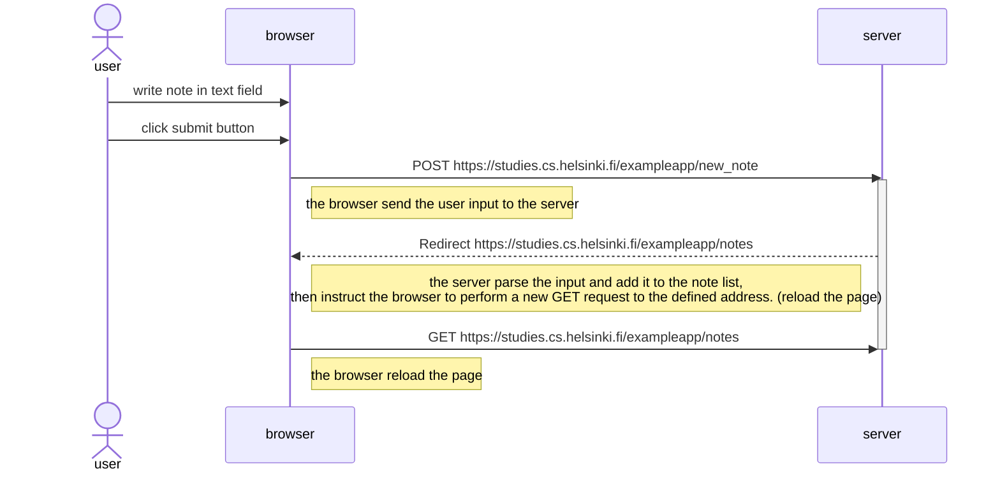

```mermaid
sequenceDiagram

    actor U as user
    participant B as browser
    participant S as server

    U->>B: write note in text field
    U->>B: click submit button

    
    B->>S: POST https://studies.cs.helsinki.fi/exampleapp/new_note
    activate S
    Note right of B: the browser send the user input to the server

    S-->>B: Redirect https://studies.cs.helsinki.fi/exampleapp/notes
    
    Note right of B: the server parse the input and add it to the note list,<br> then instruct the browser to perform a new GET request to the defined address. (reload the page)

    B->>S: GET https://studies.cs.helsinki.fi/exampleapp/notes
    deactivate S
    
    Note right of B: the browser reload the page
```