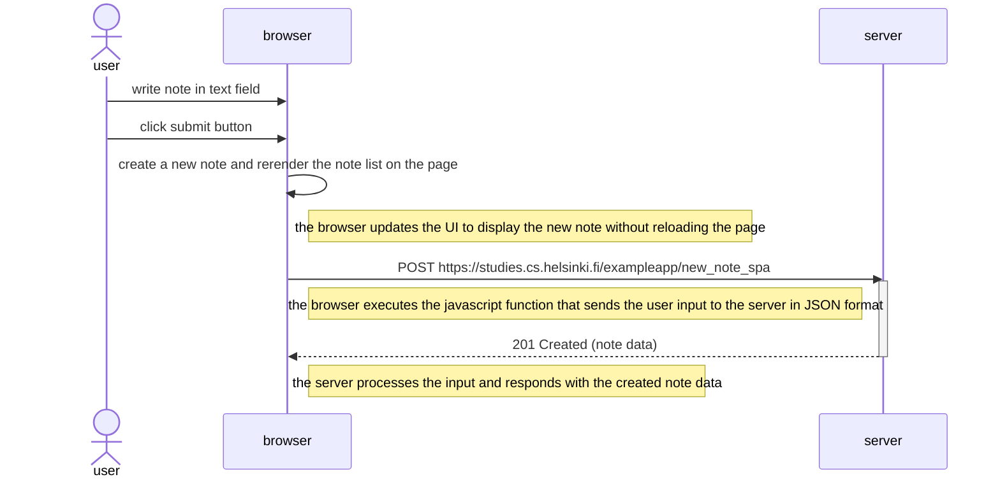

```mermaid
sequenceDiagram

    actor U as user
    participant B as browser
    participant S as server

    U->>B: write note in text field
    U->>B: click submit button

    B->>B: create a new note and rerender the note list on the page
    
    Note right of B: the browser updates the UI to display the new note without reloading the page

    B->>S: POST https://studies.cs.helsinki.fi/exampleapp/new_note_spa
    activate S
    Note right of B: the browser executes the javascript function that sends the user input to the server in JSON format

    S-->>B: 201 Created (note data)
    deactivate S
    Note right of B: the server processes the input and responds with the created note data

```